# 🌐 Lab de Troubleshooting de Rede e Serviços

Projeto prático de troubleshooting voltado à simulação de falhas comuns em ambientes de suporte técnico, abordando diagnóstico e resolução de problemas relacionados a conectividade de rede, serviços web, DNS e firewall em sistemas Windows e Linux.

---

## 🎯 Objetivo

Simular cenários reais de falhas operacionais encontradas em rotinas de suporte técnico e infraestrutura, aplicando procedimentos de diagnóstico e correção de problemas em serviços e conectividade.

---

## 🛠️ Tecnologias Utilizadas

- Oracle VirtualBox  
- Windows  
- Ubuntu Linux  
- Apache2  
- UFW Firewall  
- Ferramentas nativas de diagnóstico de rede  

---

## 🌐 Estrutura do Ambiente

O laboratório foi desenvolvido com duas máquinas virtuais interligadas por rede interna para simulação de comunicação cliente-servidor.

- **Cliente:** Windows  
- **Servidor:** Ubuntu Linux  
- **Rede Virtual:** `lab-network`  
- **Serviço Web:** Apache2  

---

## ⚙️ Configuração do Ambiente

### Rede Virtual no VirtualBox
- Adaptador 1: NAT  
- Adaptador 2: Rede Interna (`lab-network`)  

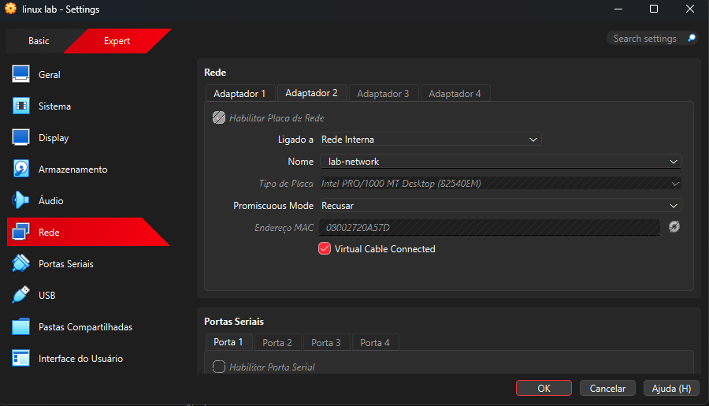

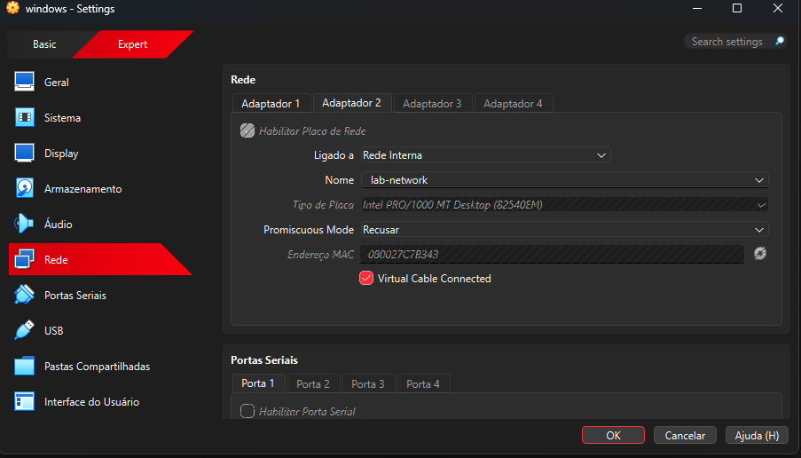

---

### Configuração do Servidor Linux
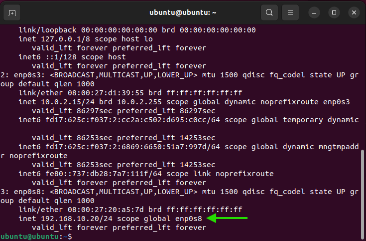

---

### Configuração do Cliente Windows
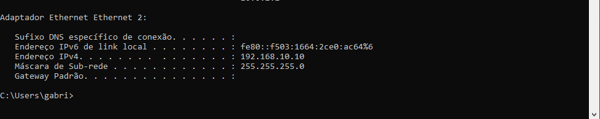

---

### Teste Inicial de Conectividade
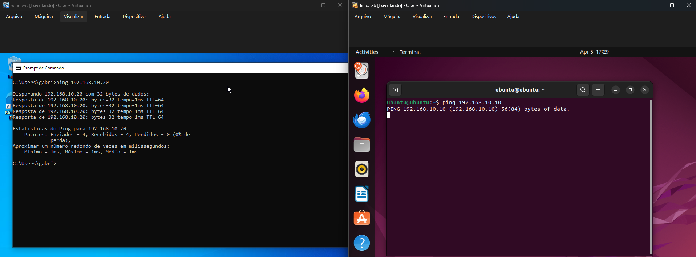

---

## 🔎 Cenários de Troubleshooting

### 🖥️ Cenário 1 — Serviço Web Inativo

Simulação de falha do serviço Apache para análise de indisponibilidade de aplicação.

#### Serviço em Execução
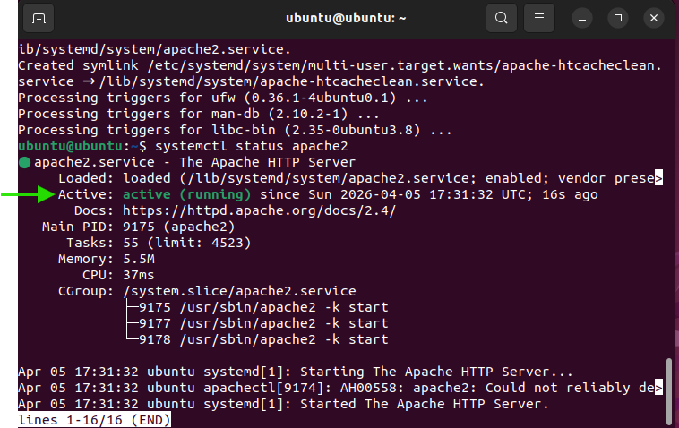

#### Aplicação Disponível
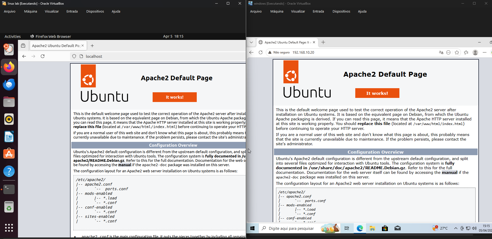

#### Falha Simulada
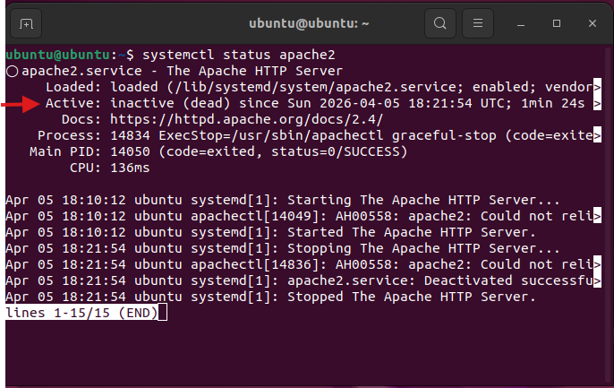

#### Aplicação Indisponível
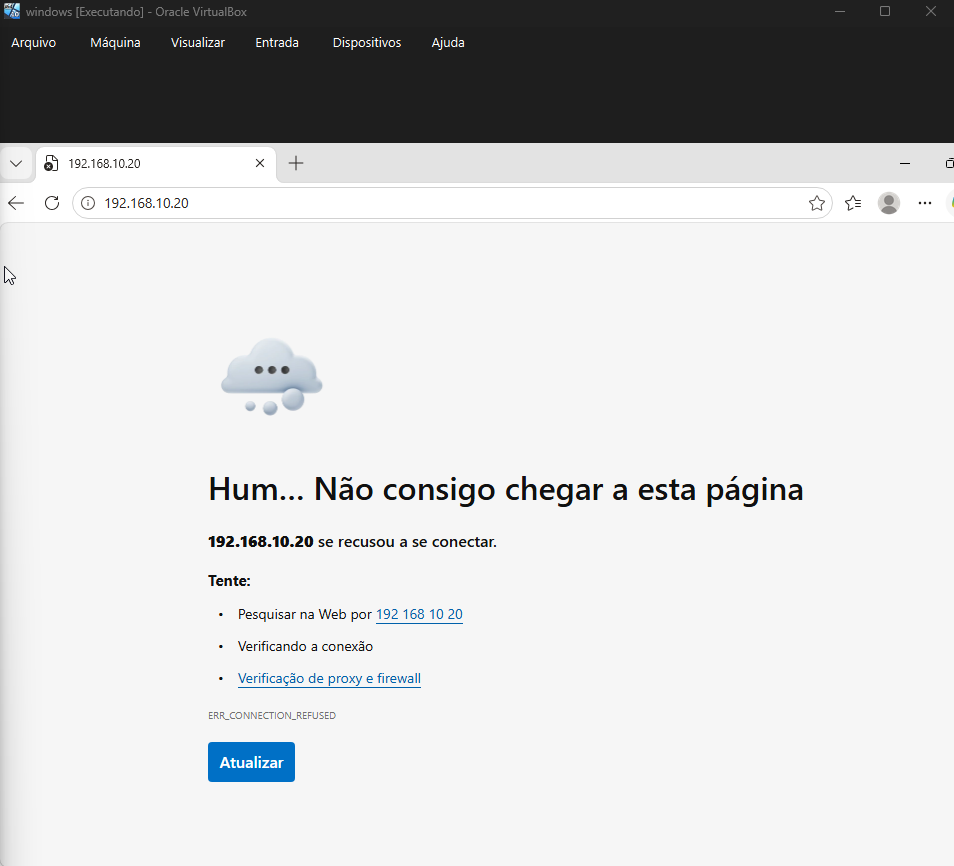

#### Validação de Conectividade
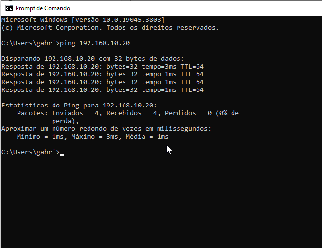

#### Diagnóstico de Porta
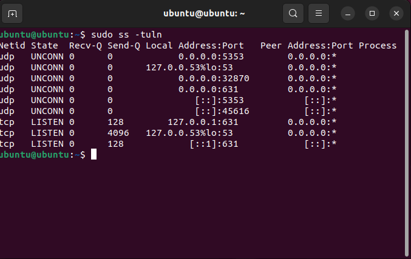

#### Status do Serviço
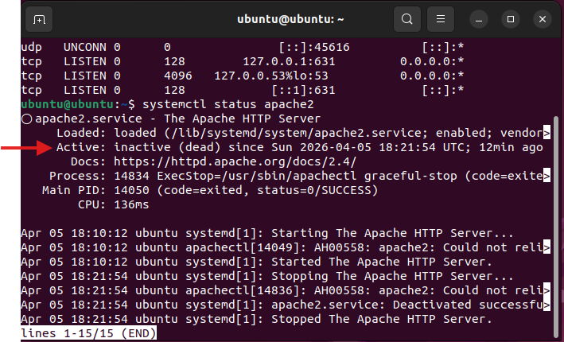

**Diagnóstico:**  
A conectividade com o servidor permanecia funcional, porém o serviço Apache encontrava-se inativo, impedindo a entrega da aplicação web.

#### Resultado Após Correção
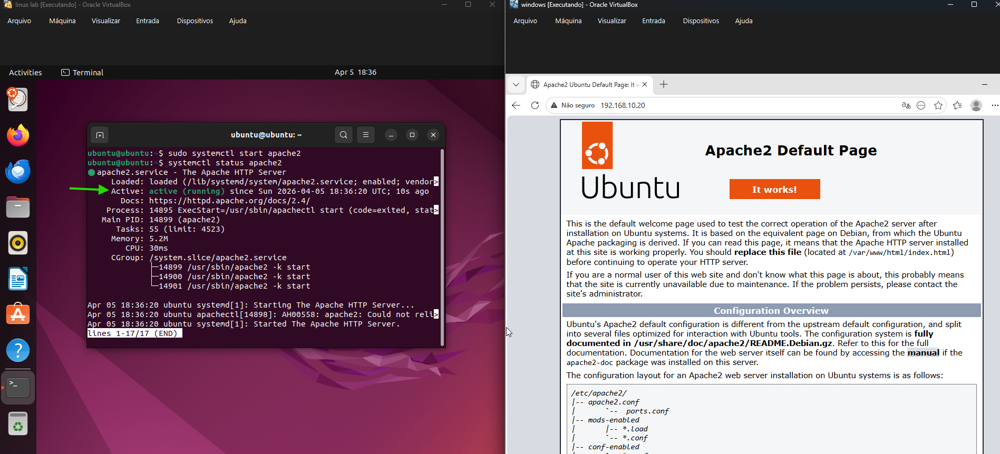

---

### 🌐 Cenário 2 — Falha de DNS

Simulação de erro de resolução de nomes causado por configuração incorreta de DNS.

#### DNS Incorreto
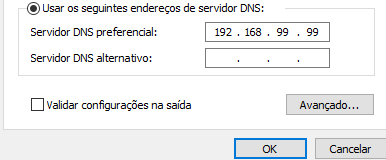

#### Falha de Resolução
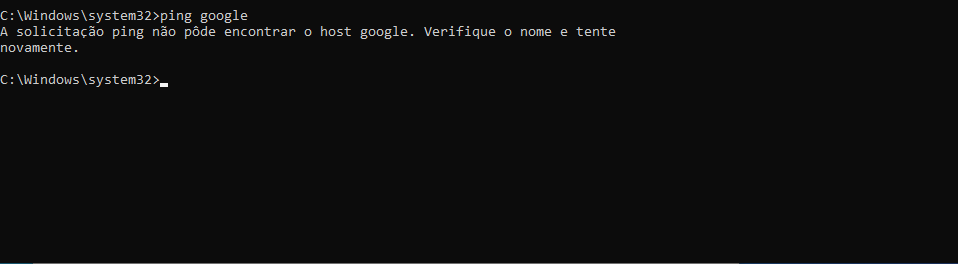

#### Teste via IP
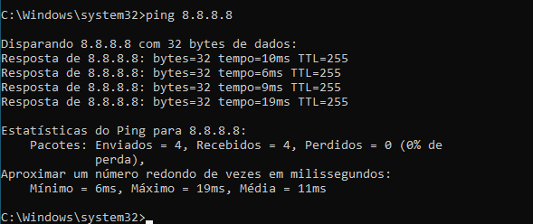

**Diagnóstico:**  
A conectividade com a internet permanecia operacional, porém a resolução de nomes falhava devido à configuração incorreta do servidor DNS.

#### Resultado Após Correção
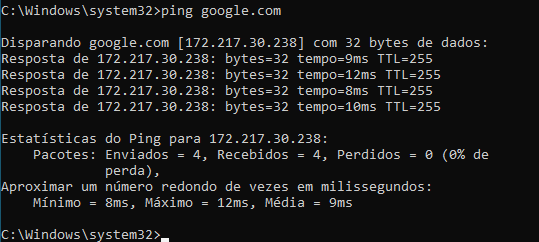

---

### 🔥 Cenário 3 — Firewall Bloqueando Serviço

Simulação de indisponibilidade causada por regra de firewall bloqueando porta de serviço.

#### Bloqueio Configurado
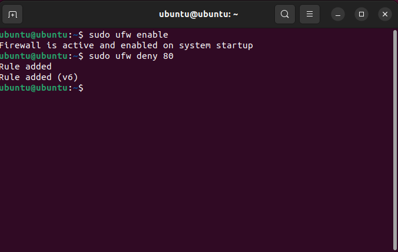

#### Ping Funcional
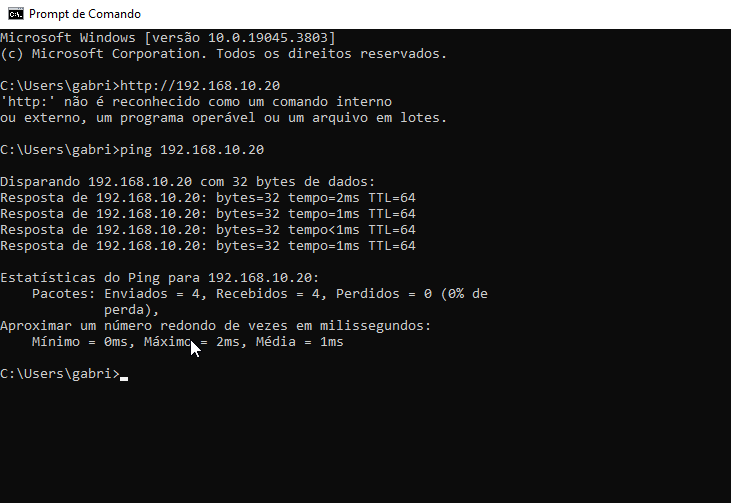

**Diagnóstico:**  
O servidor permanecia acessível via rede, porém o firewall bloqueava a porta 80, impedindo acesso ao serviço web.

#### Resultado Após Correção
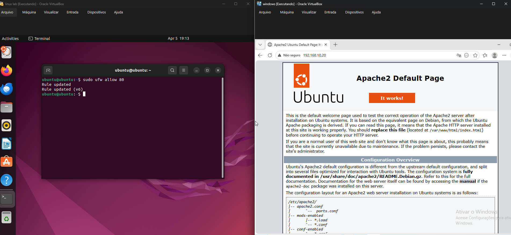

---

## 📚 Conhecimentos Aplicados

- Troubleshooting de Serviços  
- Diagnóstico de DNS  
- Gerenciamento de Firewall  
- Análise de Portas e Serviços  
- Troubleshooting de Infraestrutura  
- Diagnóstico de Rede Cliente/Servidor  

---

## 🚀 Resultado

Ao final do laboratório foi possível identificar, diagnosticar e corrigir múltiplos cenários de falha relacionados a serviços, DNS, firewall e conectividade, reforçando conhecimentos práticos aplicáveis em rotinas de suporte técnico, help desk e infraestrutura de TI.
